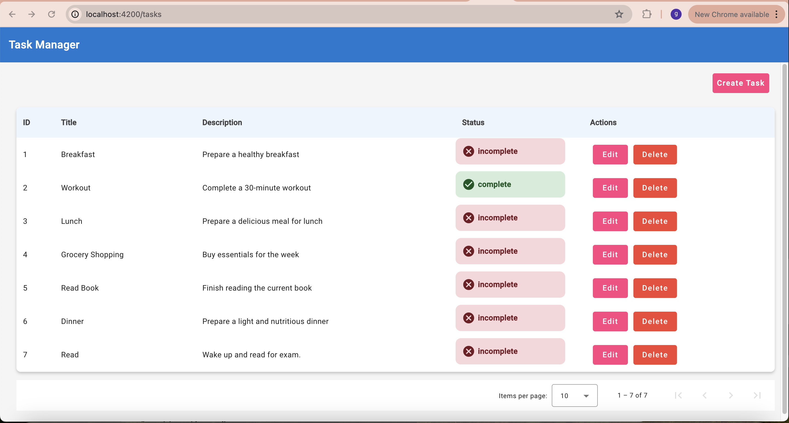
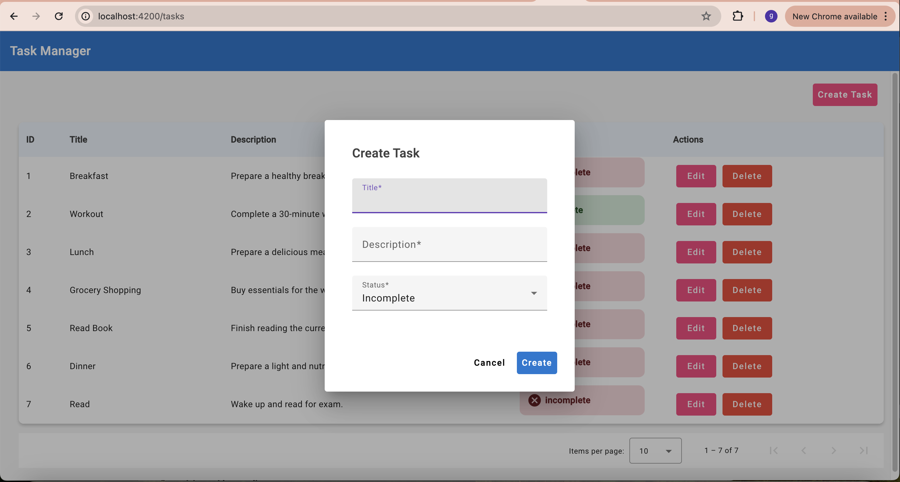
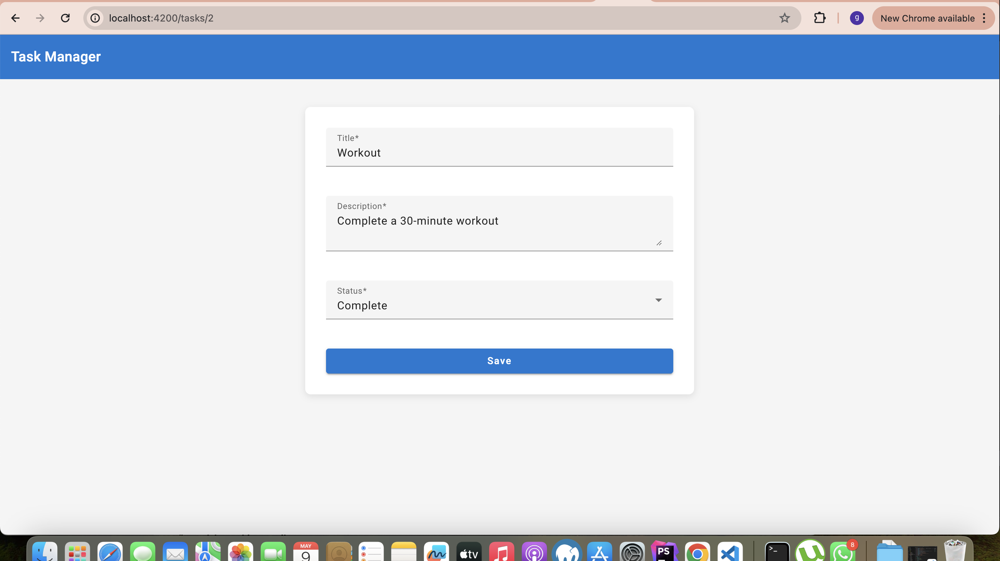

# Task Manager Application

A task management application built with Angular and Angular Material. The application provides a user-friendly interface to view, add, edit, and delete tasks. It uses `json-server` as a mock backend to simulate real-world scenarios.

## Screenshots





## Features

- Create new tasks
- View a list of tasks
- Edit existing tasks
- Delete tasks
- Responsive design using Angular Material.
- Mock backend using `json-server`.

## Getting Started

### Prerequisites

- Node.js
- npm
- Angular CLI

### Installation

1. Clone the repository:

   ```bash
   git clone https://github.com/alexmurithi/task-manager-prep.git
   ```

2. Change to the project directory:

   ```bash
   cd task-manager-app
   ```

3. Install project dependencies:

   ```bash
   npm install
   ```

4. Install Angular Material:

   ```bash
   ng add @angular/material
   ```

5. Install `json-server` globally:
   ```bash
   npm install -g json-server
   ```

### Mock Backend Setup

1.  Create a `db.json` file (if not existing) in the project root with the following content:

    ```json
    {
      "tasks": [
        {
          "id": 1,
          "title": "Breakfast",
          "description": "Prepare a healthy breakfast",
          "status": "incomplete"
        },
        {
          "id": 2,
          "title": "Workout",
          "description": "Complete a 30-minute workout",
          "status": "complete"
        },
        {
          "id": 3,
          "title": "Lunch",
          "description": "Prepare a delicious meal for lunch",
          "status": "incomplete"
        },
        {
          "id": 4,
          "title": "Grocery Shopping",
          "description": "Buy essentials for the week",
          "status": "incomplete"
        },
        {
          "id": 5,
          "title": "Read Book",
          "description": "Finish reading the current book",
          "status": "incomplete"
        }
      ]
    }
    ```

2.  Start the mock backend server:
    ```bash
    json-server --watch db.json
    ```

The server will run on `http://localhost:3000`.

### Running the Application

1. Start the Angular development server:

   ```bash
   npm start
   ```

2. Visit the application at `http://localhost:4200`.

